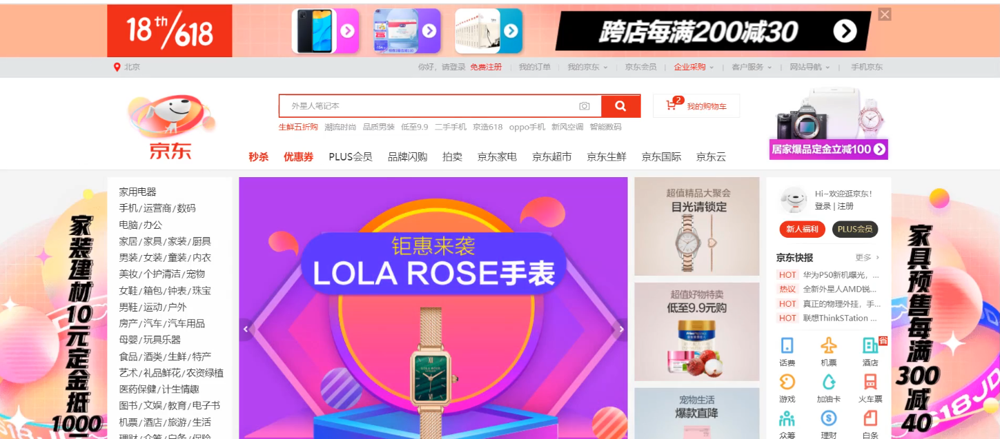
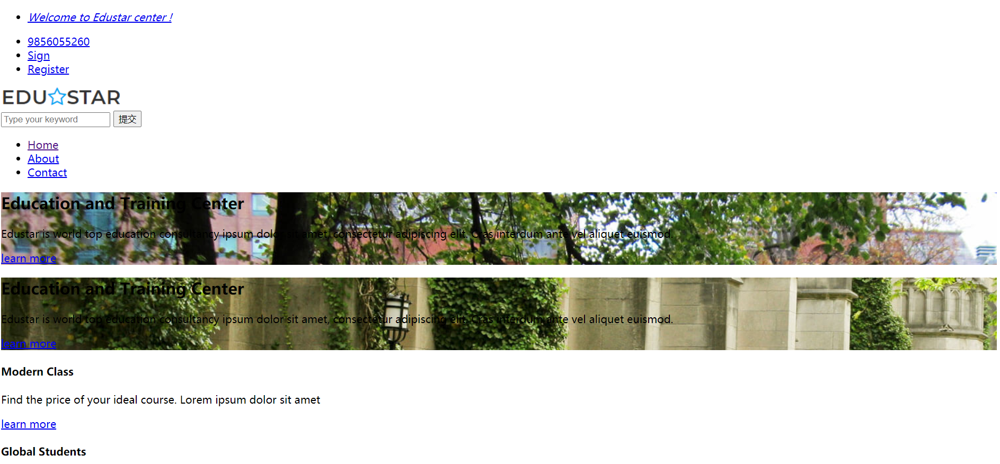
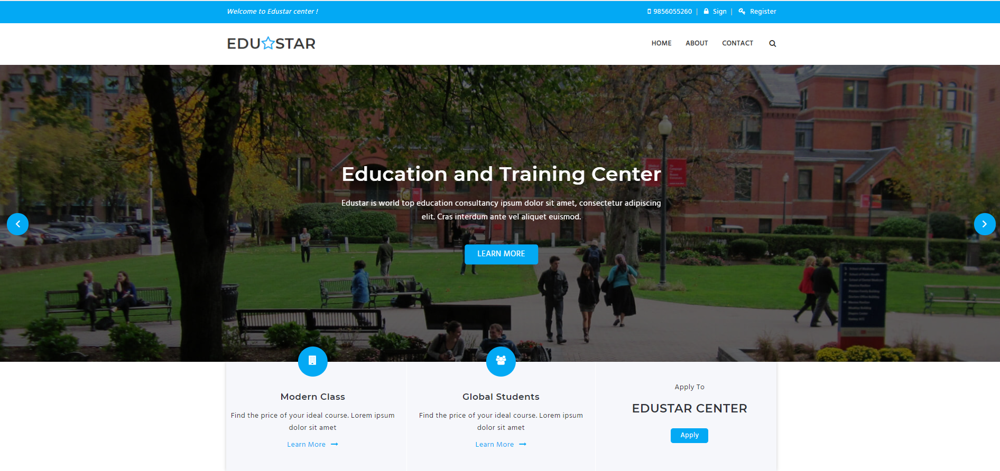
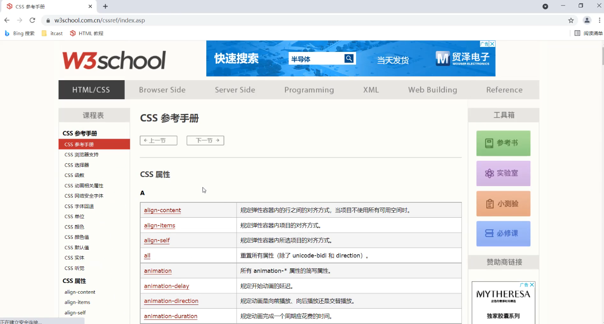

## HTML&CSS

**今日目标：**

> * 能够掌握课程中讲解的标签的使用
> * 了解css的使用

## 1，HTML

### 1.1  介绍

HTML 是一门语言，所有的网页都是用HTML 这门语言编写出来的，也就是HTML是用来写网页的，像京东，12306等网站有很多网页。




这些都是网页展示出来的效果。而HTML也有专业的解释

==HTML(HyperText Markup Language)：超文本标记语言：==

* 超文本：超越了文本的限制，比普通文本更强大。除了文字信息，还可以定义图片、音频、视频等内容

  如上图看到的页面，我们除了能看到一些文字，同时也有大量的图片展示；有些网页也有视频，音频等。这种展示效果超越了文本展示的限制。

* 标记语言：由标签构成的语言

  之前学习的XML就是标记语言，由一个一个的标签组成，HTML 也是由标签组成 。我们在浏览器页面右键可以查看页面的源代码，如下

  

  可以看到如下内容，就是由一个一个的标签组成的

  

这些标签不像XML那样可以自定义，==HTML中的标签都是预定义好的，运行在浏览器上并由浏览器解析，==然后展示出对应的效果。例如我们想在浏览器上展示出图片就需要使用预定义的 `img` 标签；想展示可以点击的链接的效果就可以使用预定义的 `a` 标签等。

HTML 预定义了很多标签，由于我们是Java工程师、是做后端开发，所以不会每个都学习，页面开发是有专门的前端工程来开发。那为什么我们还要学习呢？在公司中或多或少大家也会涉及到前端开发。

简单的给大家聊一下开发流程：

以后我们是通过Java程序从数据库中查询出来数据，然后交给页面进行展示，这样用户就能通过在浏览器通过页面看到数据。

==W3C标准：==

W3C是万维网联盟，这个组成是用来定义标准的。他们规定了一个网页是由三部分组成，分别是：

* 结构：对应的是 HTML 语言
* 表现：对应的是 CSS 语言
* 行为：对应的是 JavaScript 语言

HTML定义页面的整体结构；CSS是用来美化页面，让页面看起来更加美观；JavaScript可以使网页动起来，比如轮播图也就是多张图片自动的进行切换等效果。

为了更好的给大家表述这三种语言的作用。我们通过具体的页面给大家说明。

如下只是使用HTML语言编写的页面的结构：



可以看到页面是比较丑的，但是每一部分其实都已经包含了。接下来咱们加上 CSS 进行美化看到的效果如下：


瞬间感觉好看多了，这就是CSS的作用，用来美化页面的。接下来再加上JavaScript试试



在上图中可以看到多了轮播图，在浏览器上它是会自动切换图片的，并且切换的动态效果是很不错的。

看到了前端编写的这三个技术效果后，我们今天学习的是HTML，学习HTML其实就是学习预定义的这些标签。

### 1.2  快速入门

需求：编写如下图效果的页面


要实现这个页面，我们需要从以下三步进行实现

* 新建文本文件，后缀名改为 .html

  页面文件的后缀名是 .html，所以需要该后缀名

* 编写 HTML 结构标签

  HTML 是由一个一个的标签组成的，但是它也用于表示结构的标签

  ```html
  <html>
  	<head>
      	<title> </title>
      </head>
      <body>
          
      </body>
  </html>
  ```

  html标签是根标签，下面有 `head` 标签和 `body` 标签这两个子标签。而 `head` 标签的 `title` 子标签是用来定义页面标题名称的，它定义的内容会展示在浏览器的标题位置，如下图红框标记

  

  `body` 标签的内容会被展示在内容区中，如下图红框标记

  

  

* 在<body>中定义文字

代码如下：

```html
<html>
	<head>
    	<title>html 快速入门</title>
    </head>
    <body>
        乾坤未定，你我皆是黑马~
    </body>
</html>
```

同学们在访问其他网站页面时会看到字体颜色是五颜六色的，我们可以该字体颜色吗？当然可以了

`font` 标签就可以使用，该标签有一个 `color` 属性可以设置字体颜色，如： <font color='red'></font> 就是将文字设置成了红颜色。那么我们只需要将需要变成红色的文字放在标签体部分就可以了，如下：

```html
<html>
	<head>
    	<title>html 快速入门</title>
    </head>
    <body>
        <font color='red'>乾坤未定，你我皆是黑马~</font>
    </body>
</html>
```

==总结：==

* HTML 文件以.htm或.html为扩展名

* HTML 结构标签

  

* HTML 标签不区分大小写

  如上案例中的 `font` 写成 `Font` 也是一样可以展示出对应的效果的。

* HTML 标签属性值 单双引皆可

  如上案例中的color属性值使用双引号也是可以的。<font color="red"></font> 

* HTML 语法松散

  比如 font 标签不加结束标签也是可以展示出效果的。但是建议同学们在写的时候还是不要这样做，严格按照要求去写。


### 1.3  基础标签

基础标签就是一些和文字相关的标签，如下：


接下来我们挨个进行讲解

#### 1.3.1  标题标签

* 创建模块

  在 Idea 中创建模块，而我们现在不需要写java代码，所以 `src` 目录就可以删除掉。在模块下创建一个html文件夹，该我们今天的所以的页面文件所部放在该文件夹下。模块目录如下

  

* 创建页面文件

  选中 `html` 文件夹右键创建页面文件（01-基础标签.html）

  

  创建好后 idea 会自动加上结构标签，如下

  

  我们只需要在 `body` 标签中书写标签。

* 书写标题标签

  标题标签中 h1最大，h6最小。

  ```html
  <h1>我是标题 h1</h1>
  <h2>我是标题 h2</h2>
  <h3>我是标题 h3</h3>
  <h4>我是标题 h4</h4>
  <h5>我是标题 h5</h5>
  <h6>我是标题 h6</h6>
  ```

* 通过浏览器查看效果

  idea 提供了快捷的打开方式，如下图

  

  浏览器展示效果如下：

  

#### 1.3.2  hr标签

`hr` 标签在浏览器中呈现出 横线 的效果。

在页面文件中书写 hr 标签

```
<hr>
```

效果如下：


#### 1.3.3  字体标签

font：字体标签

* face 属性：用来设置字体。如 "楷体"、"宋体"等

* color 属性：设置文字颜色。颜色有三种表示方式

  * **英文单词**：red,pink,blue...

    这种方式表示的颜色特别有限，所以一般不用。

  * **rgb(值1,值2,值3)**：值的取值范围：0~255  

    此种方式也就是三原色（红绿蓝）设置方式。 例如： rgb(255,0,0)。

    这种书写起来比较麻烦，一般不用。

  * **#值1值2值3**：值的范围：00~FF

    这种方式是rgb方式的简化写法，以后基本都用此方式。

    值1表示红色的范围，值2表示绿色的范围，值3表示蓝色范围。例如： #ff0000

* size 属性：设置文字大小

代码演示：

```html
<font face="楷体" size="5" color="#ff0000">传智教育</font>
```

效果如下：

 

> ==注意：==
>
> font 标签已经不建议使用了，以后如果要改变文字字体，大小，颜色可以使用 CSS 进行设置。

#### 1.3.4  换行标签

在页面文件中书写如下内容

```
刚察草原绿草如茵，沙柳河水流淌入湖。藏族牧民索南才让家中，茶几上摆着馓子、麻花和水果，炉子上刚煮开的奶茶香气四溢……

6月8日下午，习近平总书记来到青海省海北藏族自治州刚察县沙柳河镇果洛藏贡麻村，走进牧民索南才让家中，看望慰问藏族群众。
```

 在浏览器展示的效果如下：


我们可以看到并没有换行。如果要实现换行效果，需要使用 换行标签（br标签）。

修改页面文件内容如下：

```
刚察草原绿草如茵，沙柳河水流淌入湖。藏族牧民索南才让家中，茶几上摆着馓子、麻花和水果，炉子上刚煮开的奶茶香气四溢……<br>

6月8日下午，习近平总书记来到青海省海北藏族自治州刚察县沙柳河镇果洛藏贡麻村，走进牧民索南才让家中，看望慰问藏族群众。
```

浏览器打开效果如下：


现在就有换行效果了。

#### 1.3.5  段落标签

上面文字展示的效果还是不太好，我们想让每一段上下都加空行。此时就需要使用段落标签（p标签）

在页面文件中书写如下内容：

```html
<p>
刚察草原绿草如茵，沙柳河水流淌入湖。藏族牧民索南才让家中，茶几上摆着馓子、麻花和水果，炉子上刚煮开的奶茶香气四溢……
</p>
<p>
6月8日下午，习近平总书记来到青海省海北藏族自治州刚察县沙柳河镇果洛藏贡麻村，走进牧民索南才让家中，看望慰问藏族群众。
</p>
```

在浏览器展示的效果如下：


这种效果就会比之前的效果好一些，呈现出段落的效果。

#### 1.3.6  加粗、斜体、下划线标签

* b：加粗标签
* i：斜体标签
* u：下划线标签，在文字的下方有一条横线

代码如下：

```html
<b>沙柳河水流淌</b><br>
<i>沙柳河水流淌</i><br>
<u>沙柳河水流淌</u><br>
```

在浏览器展示的效果如下：


#### 1.3.7  居中标签

center ：文本居中

代码如下：

```html
<hr>
<center>
    <b>沙柳河水流淌</b>
</center>
```

在浏览器效果如下：


#### 1.3.8  案例

实现如下图所示页面效果：


此案例同学们自己实现，用我们学过的基础标签。

> 注意：在上图页面中版权所有里有特殊字符，需要使用转义字符。有如下转义字符：
>
>  

### 1.4  图片、音频、视频标签


* img：定义图片

  * src：规定显示图像的 URL（统一资源定位符）

  * height：定义图像的高度

  * width：定义图像的宽度

* audio：定义音频。支持的音频格式：MP3、WAV、OGG 

  * src：规定音频的 URL

  * controls：显示播放控件

* video：定义视频。支持的音频格式：MP4, WebM、OGG
  * src：规定视频的 URL
  * controls：显示播放控件

**尺寸单位：**

height属性和width属性有两种设置方式：

* 像素：单位是px
* 百分比。占父标签的百分比。例如宽度设置为 50%，意思就是占它的父标签宽度的一般（50%）

**资源路径：**

图片，音频，视频标签都有src属性，而src是用来指定对应的图片，音频，视频文件的路径。此处的图片，音频，视频就称为资源。资源路径有如下两种设置方式：

* 绝对路径：完整路径

  这里的绝对路径是网络中的绝对路径。 格式为： 协议://ip地址:端口号/资源名称。

  如：

  ```
  
  ```

  这里src属性的值就是网络中的绝对路径。

* 相对路径：相对位置关系

  找页面和其他资源的相对路径。

  > ./    表示当前路径
  >
  > ../   表示上一级路径
  >
  > ../../   表示上两级路径

  如模块目录结构如下：

  

  在 `01-基础标签.html` 里的标签中找不同的图片，路径写法不同

  ```html
  <!--在该页面找a.jpg，就需要先回到上一级目录，该级目录有img目录，进入该目录就可以找到 a.jpg图片-->
  
  <!--该页面和aa.jpg 是在同一级下，所以可以直接写 图片的名称，也可以写成  ./aa.jpg-->
  
  ```

使用这些标签的代码如下：

```html

<audio src="b.mp3" controls></audio>
<video src="c.mp4" controls width="500" height="300"></video>
```

在浏览器展示的效果如下：


### 1.5  超链接标签

在网页中可以看到很多超链接标签，如下


上图红框中的都是超链接，当我们点击这些超链接时会跳转到其他的页面或者资源。而超链接使用的是 `a` 标签。


`a` 标签属性：

* href：指定访问资源的URL 

* target：指定打开资源的方式
  * _self：默认值，在当前页面打开
  * _blank：在空白页面打开

**代码演示：**

```html
<!DOCTYPE html>
<html lang="en">
<head>
    <meta charset="UTF-8">
    <title>Title</title>
</head>
<body>
	<a href="https://www.itcast.cn" target="_self">点我有惊喜</a>
</body>
</html>
```

效果图示：


当我们将 `target` 属性值设置为 `_blank`，效果图示：


### 1.6  列表标签

HTML 中列表分为

* 有序列表

  如下图，页面效果中是有标号对每一项进行标记的。

  

* 无序列表

  如下图，页面效果中没有标号对每一项进行标记，而是使用 点 进行标记。

  

**标签说明：**


有序列表中的 `type` 属性用来指定标记的标号的类型（数字、字母、罗马数字等）

无序列表中的 `type` 属性用来指定标记的形状

**代码演示：**

```html
<!DOCTYPE html>
<html lang="en">
<head>
    <meta charset="UTF-8">
    <title>Title</title>
</head>
<body>
    <ol type="A">
        <li>咖啡</li>
        <li>茶</li>
        <li>牛奶</li>
    </ol>
    
    <ul type="circle">
        <li>咖啡</li>
        <li>茶</li>
        <li>牛奶</li>
    </ul>
</body>
</html>
```

### 1.7  表格标签


如上图就是一个表格，表格可以使用如下标签定义

* table ：定义表格

  * border：规定表格边框的宽度  为1即可，可以随意设定

  * width ：规定表格的宽度

  * cellspacing：规定单元格之间的空白  为0

* tr ：定义行

  * align：定义表格行的内容对齐方式

* td ：定义单元格

  * rowspan:规定单元格可横跨的行数

  * colspan:规定单元格可横跨的列数

* th：定义表头单元格

**代码演示：**

```html
<!DOCTYPE html>
<html lang="en">
<head>
    <meta charset="UTF-8">
    <title>Title</title>
</head>
<body>

<table border="1" cellspacing="0" width="500">
    <tr>
        <th>序号</th>
        <th>品牌logo</th>
        <th>品牌名称</th>
        <th>企业名称</th>
    </tr>
    <tr align="center">
        <td>010</td>
        <td></td>
        <td>三只松鼠</td>
        <td>三只松鼠</td>
    </tr>

    <tr align="center">
        <td>009</td>
        <td></td>
        <td>优衣库</td>
        <td>优衣库</td>
    </tr>

    <tr align="center">
        <td>008</td>
        <td></td>
        <td>小米</td>
        <td>小米科技有限公司</td>
    </tr>
</table>
</body>
</html>
```

### 1.8  布局标签


这两个标签，一般都是和css结合到一块使用来实现页面的布局。

`div`标签 在浏览器上会有换行的效果，而 `span` 标签在浏览器上没有换行效果。

**代码演示：**

```html
<!DOCTYPE html>
<html lang="en">
<head>
    <meta charset="UTF-8">
    <title>Title</title>
</head>
<body>
    <div>我是div</div>
    <div>我是div</div>
    <span>我是span</span>
    <span>我是span</span>
</body>
</html>
```

**浏览器效果如下：**


### 1.9  表单标签

表单标签效果大家其实都不陌生，像登陆页面、注册页面等都是表单。


像这样的表单就是用来采集用户输入的数据，然后将数据发送到服务端，服务端会对数据库进行操作，比如注册就是将数据保存到数据库中，而登陆就是根据用户名和密码进行数据库的查询操作。

表单是很重要的标签，需要大家重点来学习。

#### 1.9.1  表单标签概述

> 表单：在网页中主要负责数据采集功能，使用<form>标签定义表单
>
> 表单项(元素)：不同类型的 input 元素、下拉列表、文本域等


`form` 是表单标签，它在页面上没有任何展示的效果。需要借助于表单项标签来展示不同的效果。如下图就是不同的表单项标签展示出来的效果。


#### 1.9.2  form标签属性

* **action：规定当提交表单时向何处发送表单数据，该属性值就是URL**

  以后会将数据提交到服务端，该属性需要书写服务端的URL。而今天我们可以书写 `#` ，表示提交到当前页面来看效果。

* **method ：规定用于发送表单数据的方式**

  method取值有如下两种：

  * get：默认值。如果不设置method属性则默认就是该值
    * 请求参数会拼接在URL后边
    * url的长度有限制 4KB
  * post：
    * 浏览器会将数据放到http请求消息体中
    * 请求参数无限制的

#### 1.9.3  代码演示

由于表单标签在页面上没有任何展示的效果，所以在演示的过程是会先使用 `input` 这个表单项标签展示输入框效果。

代码如下：

```html
<!DOCTYPE html>
<html lang="en">
<head>
    <meta charset="UTF-8">
    <title>Title</title>
</head>
<body>
    <form>
        <input type="text">
        <input type="submit">
    </form>
</body>
</html>
```

浏览器展示效果如下：

 

从效果可以看到页面有一个输入框，用户可以在数据框中输入自己想输入的内容，点击提交按钮以后会将数据发送到服务端，当然现在肯定不能实现。现在我们可以将 `form` 标签的 `action` 属性值设置为 `#` ，将其将数据提交到当前页面。还需要注意一点，要想提交数据，`input` 输入框必须设置 `name` 属性。代码如下：

```html
<!DOCTYPE html>
<html lang="en">
<head>
    <meta charset="UTF-8">
    <title>Title</title>
</head>
<body>
    <form action="#">
        <input type="text" name="username">
        <input type="submit">
    </form>
</body>
</html>
```

浏览器展示效果如下：

 

在输入框输入 `hehe` ，然后点击 `提交` 按钮，就能看到如下效果

 

我们可以看到在浏览器的地址栏的URL后拼接了我们提交的数据。`username` 就是输入框 `name` 属性值，而 `hehe` 就是我们在输入框输入的内容。

接下来我们来聊 `method` 属性，默认是 `method = 'get'`，所以该取值就会将数据拼接到URL的后面。那我们将 `method` 属性值设置为 `post`，浏览器的效果如下：

 

从上图可以看出数据并没有拼接到 URL 后，那怎么看提交的数据呢？我们可以使用浏览器的开发者工具来查看


按照如上步骤操作能看到如下页面


重新提交数据后，可以看到提交的数据，如下图


### 1.10  表单项标签

表单项标签有很多，不同的表单项标签有 不同的展示效果。表单项标签可以分为以下三个：  **提交必须要有name**

* \<input>：表单项，通过type属性控制输入形式

  `input` 标签有个 `type` 属性。 `type` 属性的取值不同，展示的效果也不一样

  

  注：

  **<u>button结合JavaScript一起使用</u>**

* \<select>：定义下拉列表，\<option> 定义列表项 

  如下图就是下拉列表的效果：

   

* \<textarea>：文本域

  如下图就是文本域效果。它可以输入多行文本，而 `input` 数据框只能输入一行文本。

   

> ==注意：==
>
> * 以上标签项的内容要想提交，必须得定义 `name` 属性。
> * 每一个标签都有id属性，id属性值是唯一的标识。
> * 单选框、复选框、下拉列表需要使用 `value` 属性指定提交的值。

**代码演示：**

```html
<!DOCTYPE html>
<html lang="en">
<head>
    <meta charset="UTF-8">
    <title>Title</title>
</head>
<body>
    <form action="#" method="post">
        <input type="hidden" name="id" value="123">

        <label for="username">用户名：</label>
        <input type="text" name="username" id="username"><br>
注：lable中的for  与 input中的 id 对应上  就可以了  达到通过点击用户名来选中输入框
        <label for="password">密码：</label>
        <input type="password" name="password" id="password"><br>

        性别：
        <input type="radio" name="gender" value="1" id="male"> <label for="male">男</label>
        <input type="radio" name="gender" value="2" id="female"> <label for="female">女</label>
        注：如果要达到互斥的效果，只要name属性相同就可以了
        如果不设置value的值，那么上传到后台的值就会一样，都会是on，所以我们通过value更改上床的值  男就是1  女就是2 后面的lable和上面的一样
        <br>

        爱好：
        <input type="checkbox" name="hobby" value="1"> 旅游
        <input type="checkbox" name="hobby" value="2"> 电影
        <input type="checkbox" name="hobby" value="3"> 游戏
        注：这的value的用法和上面是一样的
        <br>

        头像：
        <input type="file"><br>

        城市:
        <select name="city">
            <option>北京</option>
            <option value="shanghai">上海</option>
            <option>广州</option>
        </select>
        <br>

        个人描述：
        <textarea cols="20" rows="5" name="desc"></textarea>
        <br>
        <br>
        <input type="submit" value="免费注册"> //可以改变默认值  通过value
        <input type="reset" value="重置">
        <input type="button" value="一个按钮">
    </form>
</body>
</html>
```

在浏览器的效果如下：


## 2，CSS

### 2.1  概述

==CSS 是一门语言，用于控制网页表现。==我们之前介绍过W3C标准。W3C标准规定了网页是由以下组成：

* 结构：HTML
* 表现：CSS
* 行为：JavaScript

CSS也有一个专业的名字：==Cascading Style Sheet（层叠样式表）。==

如下面的代码， `style` 标签中定义的就是css代码。该代码描述了将 div 标签的内容的字体颜色设置为 红色。

```html
<!DOCTYPE html>
<html lang="en">
<head>
    <meta charset="UTF-8">
    <title>Title</title>
    <style>
        div{
            color: red;
        }
    </style>
</head>
<body>
    <div>Hello CSS~</div>
</body>
</html>
```

在浏览器中的效果如下：


### 2.2  css 导入方式

css 导入方式其实就是 css 代码和 html 代码的结合方式。CSS 导入 HTML有三种方式：

* 内联样式：在标签内部使用style属性，属性值是css属性键值对

  ```html
  <div style="color: red">Hello CSS~</div>
  ```

  > 给方式只能作用在这一个标签上，如果其他的标签也想使用同样的样式，那就需要在其他标签上写上相同的样式。复用性太差。不常用

* 内部样式：定义<style>标签，在标签内部定义css样式

  ```html
  <style type="text/css">
  	div{
  		color: red;
      }
  </style>
  ```

  > 这种方式可以做到在该页面中复用。

* 外部样式：定义link标签，引入外部的css文件

  编写一个css文件。名为：demo.css，内容如下:

  ```css
  div{
  	color: red;
  }
  ```

  在html中引入 css 文件。

  ```html
  <link rel="stylesheet"  href="demo.css">
  ```

  > 这种方式可以在多个页面进行复用。其他的页面想使用同样的样式，只需要使用 `link` 标签引入该css文件。rel="stylesheet" 是为了解析css文件

**代码演示：**

项目目录结构如下：


编写页面 `02-导入方式.html`，内容如下：

```html
<!DOCTYPE html>
<html lang="en">
<head>
    <meta charset="UTF-8">
    <title>Title</title>
    <style>
        span{
            color: red;
        }
        //span标签  是下面css中所有span标签全部生效
    </style>
    <link href="../css/demo.css" rel="stylesheet">
</head>
<body>
    <div style="color: red">hello css</div>

    <span>hello css </span>

    <p>hello css</p>
</body>
</html>
```

### 2.3  css 选择器

注：**选择的范围越小那么就是用哪个选择器**

css 选择器就是选取需设置样式的元素（标签），比如如下css代码：

```css
div {
	color:red;
}
```

如上代码中的 `div` 就是 css 中的选择器。我们只讲下面三种选择器：

* 元素选择器

  格式：

  ```css
  元素名称{color: red;}
  ```

  例子：

  ```
  div {color:red}  /*该代码表示将页面中所有的div标签的内容的颜色设置为红色*/
  ```

* id选择器  （id唯一，所以这个选择器是唯一）

  格式：

  ```css
  #id属性值{color: red;}
  ```

  例子：

  html代码如下：

  ```html
  <div id="name">hello css2</div>
  ```

  css代码如下：

  ```css
  #name{color: red;}/*该代码表示将页面中所有的id属性值是 name 的标签的内容的颜色设置为红色*/
  ```

* 类选择器

  格式：

  ```css
  .class属性值{color: red;}
  ```

  例子：

  html代码如下：

  ```html
  <div class="cls">hello css3</div>
  ```

  css代码如下：

  ```css
  .cls{color: red;} /*该代码表示将页面中所有的class属性值是 cls 的标签的内容的颜色设置为红色*/
  ```

**代码演示：**

```html
<!DOCTYPE html>
<html lang="en">
<head>
    <meta charset="UTF-8">
    <title>Title</title>
    <style>
        div{
            color: red;
        }

        #name{
            color: blue;
        }

        .cls{
            color: pink;
        }
    </style>

</head>
<body>
    <div>div1</div>
    <div id="name">div2</div>
    <div class="cls">div3</div>
    <span class="cls">span</span>
</body>
</html>
```


### 2.4  css 属性

css属性我们不作为重点讲解。我们简单的看一下css的文档



css有很多css属性，你要想把它们都学会，需要花费很长的时间。而我们作为java程序员，不需要重点掌握这部分内容。对于网页三剑客中css是对我们要求最低的。给大家简单介绍一下文档怎么查看即可，如下我们看一个 `background-color` 属性


点击进去后能看到下面界面


上面就列举了该属性的具体的使用，你也可以点击下面的 `亲自试一试` 看效果。
